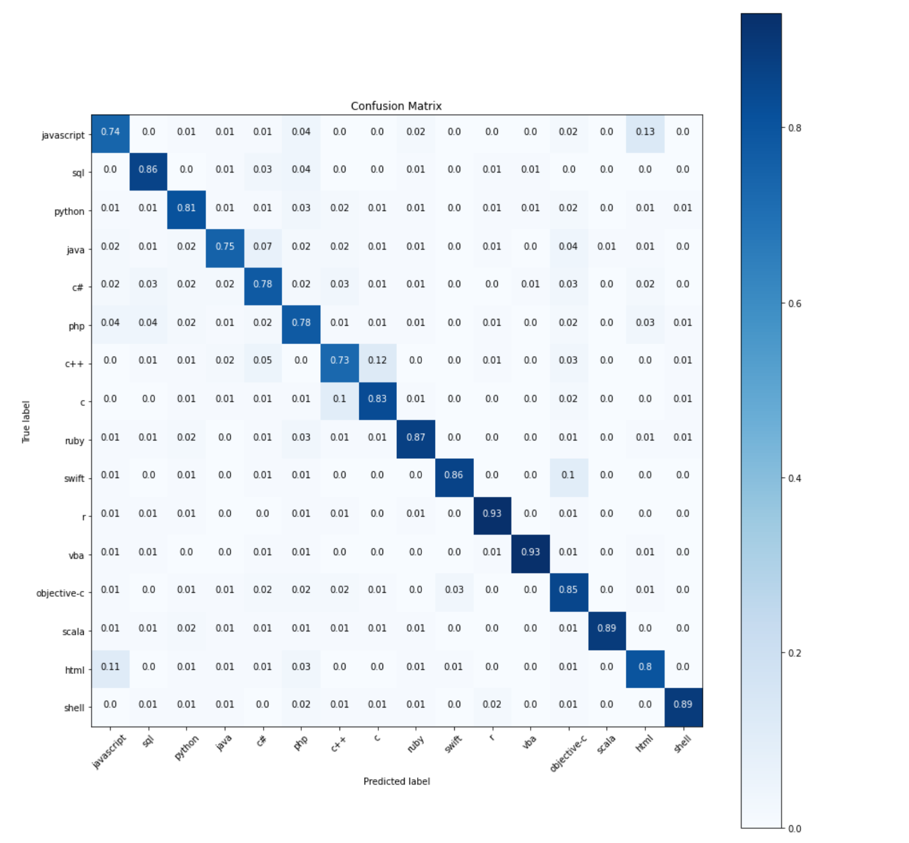

# Predicting-the-Programming-Language-of-SatckOverflow-Questions-using-Natural-Language-Processing

I used a LSTM based Deep learning model to predict the 16 most popular programming languages of 2019. I considered the title and body of a question to make prediction. I used a three-layer LSTM network as LSTMs is so effective for the sequential dataset and are widely preferred in NLP domain.

## Data

I used [StackSample dataset](https://www.kaggle.com/stackoverflow/stacksample) which is a collection of more than 1 million StackOverflow questions, answers and tags.

## Requirements

Python 3.7

Keras 2.3

Numpy 1.18

Pandas 1.0

Matplotlib 3.1

NLTK 3.4.5

Re 2.2.1

## Result

When testing on an unseen test set, I achieved an accuracy of 82.34% on this task.

## Confusion Matrix

## References

[Predicting the Programming Language of Questions and Snippets of StackOverflow Using Natural Language Processing,](https://arxiv.org/pdf/1809.07954.pdf) Kamel Alrashedy
